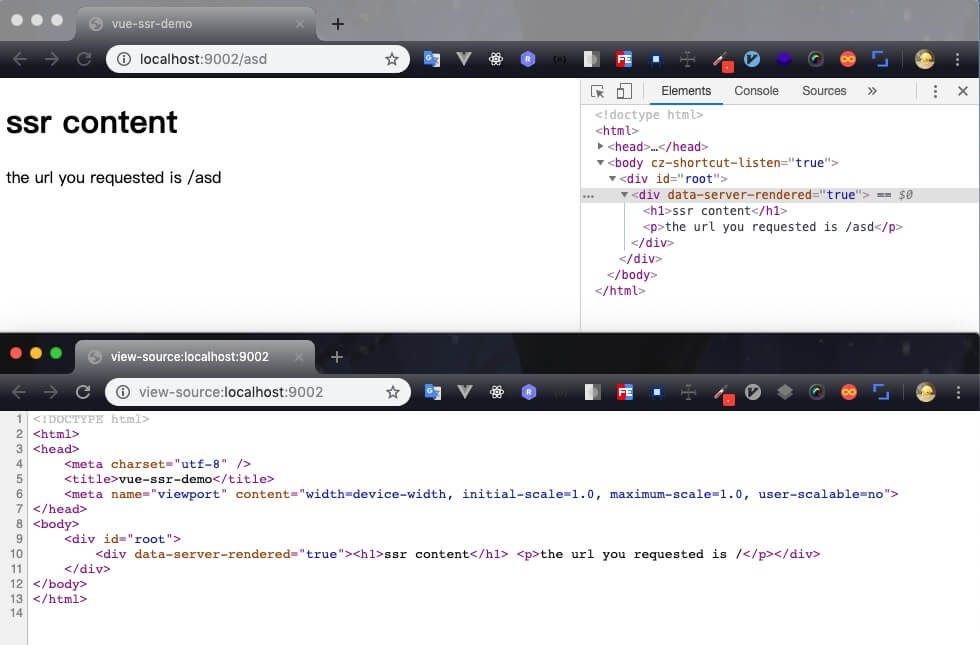

# vue-ssr-demo
a demo using vue-ssr

## Branch vue-ssr
基于vue-spa分支逐步改造成ssr

## Install & Run 
``` bash
npm install

# 开发
npm run dev

# 发布
npm run build
```

## Steps

### step-1. 进行vuex改造，Commit Id: [7f3c954](https://github.com/xuboxun/vue-ssr-demo/commit/7f3c95432ff017f0ab27407336c1df68892a4417)  
因为spa中采用比较省事儿的写法，直接在页面组件中发起ajax请求，数据存在组件的data中。  
但是当我们使用服务端渲染时：
- 如果依赖于一些异步的数据，需要在服务端渲染之前就得到这些数据，即数据预取
- 然而这时候vue组件还没有开始渲染，所以需要先把数据存在一个地方
- 当vue组件开始渲染时，需要再将预取的数据拿出来，传入组件
- 当客户端挂载时，可以理解为此时的state是spa中某一个时间点的快照，但是这个快照对于客户端来说是一个初始state，即__INITIAL_STATE__，后续的操作还要基于这个初始状态来进行状态处理。所以我们需要在客户端挂载之前获取到和之前服务端完全一样的状态数据。

为了解决上述问题，ajax请求得到的数据需要独立于视图组件之外，放置在专门的数据存储容器中。所以我们首先对项目改造，使用vuex来保存数据，将数据请求和数据存储独立成service和store。  

以上内容可参考vue ssr指南[数据预取](https://ssr.vuejs.org/zh/guide/data.html#%E6%95%B0%E6%8D%AE%E9%A2%84%E5%8F%96%E5%AD%98%E5%82%A8%E5%AE%B9%E5%99%A8-data-store)部分

## step-2. 引入express提供后端服务，Commit Id: [a09dbf2](https://github.com/xuboxun/vue-ssr-demo/commit/a09dbf2f417d74082b72053641142d156a90f049)  
既然是服务端渲染，那么必然需要一个http服务，我们使用express来提供这方面的能力。  
在server.js中，我们使用index.template.html作为页面的基本模板，服务端渲染的字符串内容将插入到```<!--vue-ssr-outlet-->```所在的位置。  
对于所有的http请求，我们都返回固定的内容；并且，在接收到每一个请求时，都创建一个新的根Vue实例。这与vue-spa中使用一个单一的Vue实例不同，因为如果我们创建一个单一的Vue实例，那么它将在每次请求时共享，很容易造成** 交叉请求状态污染 **  
对于交叉请求状态污染，我的理解是这样的：
- 假设第一个用户发起请求请求，返回得到的状态state1以及页面内容view1，但是由于访问改变了这个单一的Vue实例对象的状态，由state1转变为state2，对应的页面因为状态的改变由view1变为view2
- 当第二个用户发起同样请求的时候，正常的应该是访问state1以及对应的view1，但是由于状态已经改变了，所以最后访问得到的状态是state2以及页面view2
- 而对于不同用户同样的http请求，却返回了不同的状态和内容，这就是交叉请求状态污染
- 所以为了避免状态污染，我们需要对每一次请求，都保证是一个全新的应用实例

创建完server.js我们```npm run ssr```来运行，访问localhost:9002，可以看到，原来模板中```<!--vue-ssr-outlet-->```的地方已经被服务端渲染出的字符串代替，且查看源代码，发现页面内容已经包含在html中，而不是由js去动态生成的。

我们查看Elements看到，有一个```data-server-rendered="true"```，他的作用是让客户端vue知道这部分内容是由服务端vue渲染的，并且以激活模式进行挂载。  
因为当我们在客户端收到页面的html生成DOM结构后，不需要丢弃它重新由客户端vue重新生成一遍，只需要客户端vue接管这些静态的html，“激活”他们，让他们后续可以动态响应数据变化。

## step-3. 改写组件、路由和Store，Commit Id: [0415b45](https://github.com/xuboxun/vue-ssr-demo/commit/0415b459f3612bf05052757d3c5507837053eb00)
如step-2中所述，为避免交叉请求状态污染，我们需要从spa中的创建单例对象，变为创建工厂函数，每次调用时都创建一个新的对象。  
- 首先是对路由进行改写：由原来的一个router对象变为一个createRouter函数
- 其次是对Store的改写：由原来的一个store对象变为createStore函数；同时需要注意的是，由于使用了模块，对模块的导出也需要封装成工厂函数，每次返回一个新的对象
- 最后是对main.js的改写：由原来的new Vue()变为一个createApp函数，在函数内部执行new Vuex()，即每次都生成一个新的vue实例。

还需要改写页面组件，将created中调用的action放到asyncData中，以便于在服务端渲染组件之前去调用得到要渲染的数据

## step-4. 入口文件, Commit Id: [10740dd](https://github.com/xuboxun/vue-ssr-demo/commit/10740dd51dc8ec5123a4730192f9243aaf1c499a)
新建两个入口文件分别用于客户端和服务端的webpack配置，原先spa中的入口文件作为这两个入口的依赖，引入createApp创建应用实例。   
对于服务端入口：
- 导出一个函数，每次渲染时都重复调用，创建和返回应用实例
- 因为可能会是异步路由，所以函数中返回一个Promise，以便服务器可以等待所有内容准备就绪再开始渲染
- 通过路由获取到所有匹配的组件，并执行asyncData以获取数据，即我们在step-2中组件中加入的asyncData
- 当所有的组件都执行完asyncData后，将state添加到上下文中，即```context.state = store.state;```。当时用了template时，会将初始状态通过```window.__INITIAL_STATE__```的方式，以```script```注入到html中

对于客户端入口：
- 只需要创建应用程序并挂载到DOM中
- 当初始路由完成后（以便不会重复获取服务端已返回的数据）添加路由钩子函数用于处理asyncData。

## step-5. webpack构建配置，Commit Id: [3592517](https://github.com/xuboxun/vue-ssr-demo/commit/359251784da859525021980cd53278e77502500e)
需要注意的是，server端的css不能使用mini-css-extract-plugin，所以对css的处理需要将client和server区分开。

## step-6. 服务端，Commit Id: [76e9ce8](https://github.com/xuboxun/vue-ssr-demo/commit/76e9ce815fa28baaeab5a2aa33df5b9036b83100)
提供http服务
